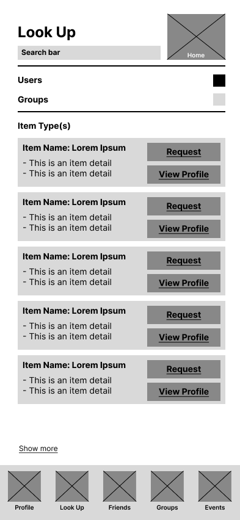
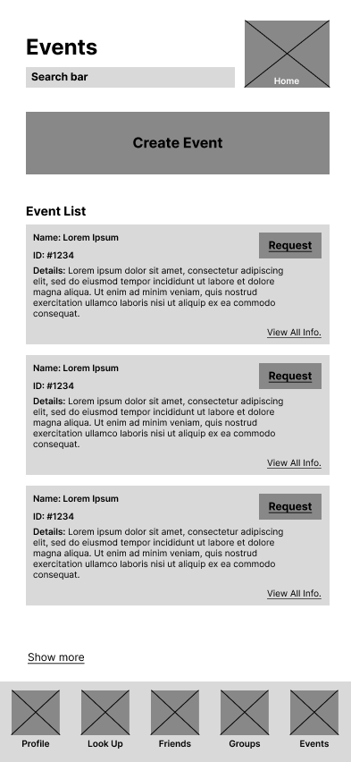
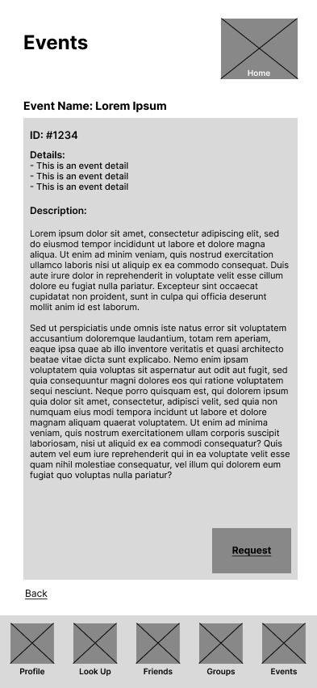

# User Experience Design

This repository contains instructions and files for two assignments that together comprise the user experience design phase of a web app.

Replace the contents of this file with the completed assignments, as described in:

- [app map & wireframe instructions](instructions-0a-app-map-wireframes.md).
- [prototype instructions](instructions-0b-prototyping.md)

# App Prototype
[Link to the Clickable Prototype](https://www.figma.com/proto/NUrsgWWd7bYRWXnVhkWUUK/Add-Ext.-Calendar-Wireframe?node-id=44%3A78&scaling=scale-down&page-id=20%3A60&starting-point-node-id=44%3A78)

This is the clickable / tappable mobile prototype for the Minimum Viable Product (MVP) of our application. Through this prototype, we have connected the wireframes that we created in Figma for the pages of our application. The prototype enables users to get a better understanding of how the different pages of our app are interconnected, and how they're accessed from within one another. It also includes some overlays that appear when you try to add an event to the calendar, select a month etc. 

# App Map 

The app map depicts major pages that users can access. It demonstrates the parent/child relation of each page. 

# Sign In / Login 

# Homepage (Personal Calendar) 

The homepage will be the user's personal calendar, where they can view their upcoming schedules.

# Adding events to Personal Calendar 

- When a user decides to add a new event on their personal calendar they will tap a date on the calendar on the hopepage, and then be shown the schedule of the day with the bottom portion being any new event they want to add. 

# User Profile 

- The Profile page shows a User's profile information, as well as allowing them to navigate to their Account Settings or Add External Calendars to their profile.

- This page is a navbar item, and will be always be accessible from the HomePage and any of the HomePages first children, see AppMap for more details.

# Look Up Profile 

- The Look Up page allows a user to look for users and groups. For the users and groups, one can either view their public profile, or request to add friend or join group.

- This page is a navbar item, and will be always be accessible from the HomePage and any of the HomePages first children, see AppMap for more details.

# Profile Calendar

- The Profile Calendar page allows a user to look at the public calendar of someone's profile.

- A user can click on a date in the calendar to open the page for the date as follows:

# Profile Calendar (Date Clicked)

.png)

- This page allows a user to view the schedule for a date in another user's public calendar.

# Friends 

- The Friends page shows a users friend list, allowing them to quickly find out who they are connected to and view their friends private profile.

- This page is a navbar item, and will be always be accessible from the HomePage and any of the HomePages first children, see AppMap for more details.

# Friend Calendar

- The Friend Calendar page allows a user to look at the calendar of someone they're friends with profile.

- A user can click on a date in the calendar to open the page for the date as follows:

# Friend Calendar (Date Clicked)

.png)

- This page allows a user to view the schedule for a date in a friend's calendar.
- Through this page, a user can also create an event for an activity with their friend for the given date.

# Groups

- The Groups page shows a users group list, allowing them to quickly find out which groups they are in and to and view their group private profile. 

- The Groups page also contains a 'Create Group' button allowing them to navigate to the Create Groups page easily. 

- This page is a navbar item, and will be always be accessible from the HomePage and any of the HomePages first children, see AppMap for more details.

# Group Calendar

- The Group Calendar page allows a user to look at the calendar of a group they're part of.

- A user can click on a date in the calendar to open the page for the date as follows:

# Group Calendar (Date Clicked)

.png)

- This page allows a user to view the schedule for a date in a group's calendar.
- Through this page, a user can also create an event for an activity with their group for the given date.

# Create Group

- This page enables users to create groups, add a profile picture for the group and invite their friends to the group.

# Events

- The Events page shows a list of all public events, allowing a user to either view detailed event information, or request to join event.

- The Events page also contains a 'Create Event' button allowing them to navigate to the Create Events page easily.

- This page is a navbar item, and will be always be accessible from the HomePage and any of the HomePages first children, see AppMap for more details.

- This information page displays the full information for a single event, and can be navigated to only from the events feed page. 

- A user can either go back to the main events page, or if interested after viewing all relevant information, can request to join event.

# Create Event Page

- This page allows users to create events for a specified date. They can also invite selected friends for the event from this page.

# Add External Calendar

- This page enables users to import `.ical` calendars to the app to either add events from the calendar or replace current personal calendar.

- This page has the following options:
  - Event Addition:
  1. Add all event from the imported calendar
  2. Add events from specified months from the imported calendar
   - Calendar Merging / Replacement:
  1. Add events from imported calendar to existing personal calendar
  2. Replace existing personal calendar.

You may also notice that clicking the month drop-down menu button brings up the select month overlay, which is as follows:

# Select Month Overlay

- This page enables users to either select a month of the year or return to the calling page
- Useful for creating events

# Create Event Overlay

- This overlay enables users to create an event for a given date from their own home page (i.e., user profile calendar)